* 요약: DNN training input pipeline 상의 data stalls을 탐지 및 해결하여 CPU/GPU utilization 향상

---

## INTRODUCTION
* DNN 학습의 정확도를 높이기 위해선, 모델을 매우 많은 데이터로 학습시켜야 한다.
* DNN 학습은 data-hungry, resource-intensive, time-consuming한 특성이 있으며, 스토리지로부터 데이터를 페칭하고, CPU로 이를 전처리하는 과정 전체가 여기에 포함된다.
* 자원을 효율적으로 활용하기 위한 연구들(e.g., 통신 오버헤드 제거, GPU 메모리 최적화, 컴파일러 기반 연산자 최적화)은 많으나, 스토리지 시스템과 데이터 파이프라인 관점에서 진행된 연구는 상대적으로 적다.
* 데이터 파이프라인은 일반적으로 다음의 과정으로 이루어져 있다.
  1. 스토리지로부터 샘플을 몇 개 페치한다.
  2. 메모리에서 전처리한다. (e.g., decompression, cropping, resizing, rotating)
  3. 전처리가 끝난 샘플은 GPU로 보내어, 학습에 사용하도록 한다.
* 데이터 파이프라인은 GPU의 연산과 병렬적으로 수행되어, 현 샘플의 학습이 끝나자마자 다음 샘플을 학습할 수 있도록 하는 것이 이상적이나, 그렇지 않은 경우도 많다. (이하 Data stalls라고 칭함)
  - 페치에 걸리는 시간이 긴 I/O-bound, *fetch stalls*
  - 전처리에 걸리는 시간이 긴 CPU-bound, *prep stalls*
* Data stalls 해결 방안을 다룬 연구들이 있었다.
  - **Quiver**: 원격 오브젝트 스토리지의 데이터를 로컬 스토리지에 캐싱하여 DNN 학습 속도를 개선하는 연구. 본 논문은 데이터 세트의 크기가 로컬 스토리지의 용량보다 작은 경우(일반적)만 상정하므로 Quiver보다 더 나은 성능을 보여준다.
  - **Cerebro and DeepIO**: 분산 학습에서 데이터 페치를 최적화하는 연구. 본 논문은 단일 서버 학습 시나리오를 다루며, 다양한 학습 시나리오에서의 data stalls을 시스템적인 측면에서 분석했다는 점에서 의의가 있다.

### Contributions
* Data stalls의 분류, 측정, 분석
  - 3개의 도메인(이미지 분류, 객체 탐지, 오디오 분류)에 속한 총 9개의 유명 DNN 모델, 4종의 데이터 세트를 이용하여 분석했다.
  - 스토리지 장치 종류, 메모리에 캐싱 가능한 데이터 세트의 크기, CPU 스레드 개수, GPU 세대 등의 다양한 변수가 미치는 영향 또한 분석했다.
  - 빠른 GPU를 가진 서버, 특히 ML에 최적화된 서버일수록 data stalls로 인한 성능 저하 정도가 더 크게 드러났다.
    + Our analysis finds that data stalls squander away the improved performance of faster GPUs, even on ML optimized servers like the DGX-2.
  - OS의 페이지 캐시 정책이 DNN 워크로드에 부적합하다는 것을 밝혔다.
  - 여러 DL frameworks가 CPU와 메모리 자원을 비효율적으로 사용하고 있다는 것을 발견했다.
* Data stalls의 predictive what-if 분석 수행
  - DNN 학습은 고수준의 병렬화가 이루어졌기 때문에, 단일 작업에 걸리는 시간만 분리해서 측정하기는 매우 어렵다.
  - 본 연구에서 개발한 도구 DS-Analyzer는 data stalls를 정확하게 탐지할 수 있으며, 개선 방안을 구체적인 문장으로 제시한다.
* Data stalls 개선
  - 본 연구에서는 user-space 데이터 로딩 라이브러리 CoorDL을 구축했다. (on top of DALI)
  - CoorDL은 기존 클러스터 인프라를 변경하지 않고도 사용할 수 있다.
  - DNN 학습에 최적화된 소프트웨어 캐시, *MinIO*를 구현했다.
  - 여러 서버들의 MinIO 캐시를 조직화하는, *partitioned cache* 기법을 제시했다.
  - 하이퍼파라미터 탐색에서 발생하는 중복 전처리 작업을 없애는 *coordinated prep*을 고안했다.

## BACKGROUND
### The DNN ETL(Extract-Transform-Load) Requirements
* 매 에포크마다 입력 데이터 세트에 대해 ETL을 수행한다.
* 모델의 정확도를 일정 수준 이상으로 달성하기 위한 알려진 규칙이 존재한다.
  - 데이터 세트는 한 에포크를 시작하기 전 무작위로 섞인다. (과적합 방지)
  - 한 에포크에 데이터 세트에 포함된 샘플은 딱 한 번만 사용된다.
  - 샘플 전처리를 무작위로 수행한다. 한 샘플에 동일한 전처리를 두 번 이상 하지 않는다.
* 본 논문에서는 그러한 규칙을 준수한다.

### DALI: Fast Data Pipelining
* DALI는 전처리에 GPU 가속기를 활용하여 데이터 전처리 시간을 줄이는 데이터로더(dataloader)다.
* PyTorch, TensorFlow의 기본 데이터로더를 웃도는 성능을 보여준다.
  - 본 논문에서는, DALI를 strongest baseline으로 잡았다.

## DATA STALLS IN DNN TRAINING
* 일반적인 DNN 학습 과정은 다음과 같다.
  1. 스토리지로부터 미니배치를 가져온다.
  2. 샘플을 전처리한다.
  3. 미니배치를 GPU로 넘겨 처리한다.
  4. 손실 함수를 계산하여 모델이 얼마나 올바른 예측을 했는지 판단한다.
  5. 모델의 가중치를 업데이트한다. (gradient computation)
* 이상적으로는, 3-5에 걸리는 시간이 제일 긴 것이 좋다. (Highly utilized GPUs)
* 일반적으로 1-2 단계(데이터 준비 단계)를 수행하는 스레드가 여럿 있는 방식(준비 과정 파이프라이닝)을 채택한다.
* 1단계에 걸리는 시간이 긴 경우를 **fetch stall**이라고 한다. 이는 스토리지 장치에 영향을 크게 받는다.
* 2단계에 걸리는 시간이 긴 경우를 **prep stall**이라고 한다. 이는 전처리 연산 종류와 CPU 코어 수에 영향을 크게 받는다.

## ANALYZING DATA STALLS
### Methodology
 * For the image classification task, pre-processing includes image decoding, random crop, resizing to a fixed size, and a random horizontal flip of the image.
 * We have empirically verified that DALI’s performance is strictly better than PyTorch, TF and MxNet’s default data loaders.
 * Training environment:
	- All experiments are performed on PyTorch 1.1.0 using the state-of-the-art NVIDIA data loading pipeline, DALI.
	- SSD-V100: 8xV100 GPU, 32GB GPU Mem, SSD, 530 MBps Rand Read
	- HDD-1080Ti: 8x1080Ti, 11GB GPU Mem, HDD, 15-50 MBps Rand Read
 * Training parameters:
	- In SSD-V100: use a batch size of 512 per GPU for all image classification models, 128 per GPU for SSD-Res18, 16 per GPU for M5
	- In HDD-1080Ti: use the maximum batch size that fits the GPU memory
 * Training metrics: The average epoch time of three epochs, ignoring the first epoch. (used for warmup)

### Measuring Data Stalls Using DS-Analyzer

### Data Stalls in DNN Training
* **데이터 세트가 원격 스토리지에 있는 경우**

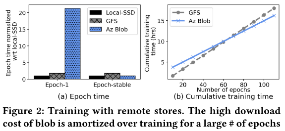 

* **데이터 세트를 완전히 캐시할 수 없는 경우**

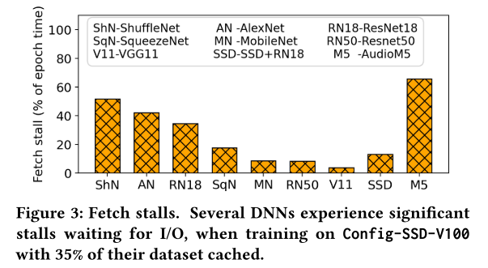
* Figure 3은 한 에포크에서 I/O에 걸리는 시간이 상당함을 나타낸다.
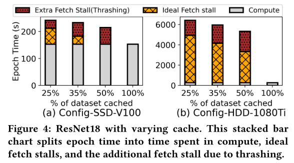
* Figure 4는 OS 캐시 정책(LRU)이 DNN 학습 워크로드에 적합하지 않음을 보여준다.

* **데이터 세트를 메모리에 모두 저장할 수 있는 경우**

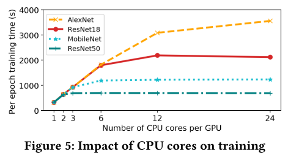
* Figure 5는 모델에 따라서 CPU 코어 수가 학습 시간에 미치는 영향이 달라짐을 보여준다.

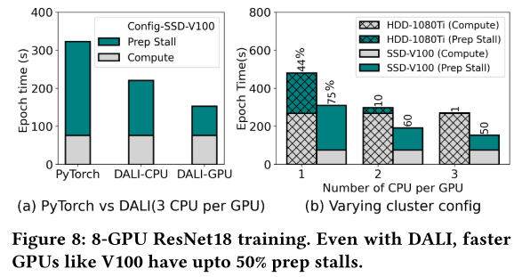

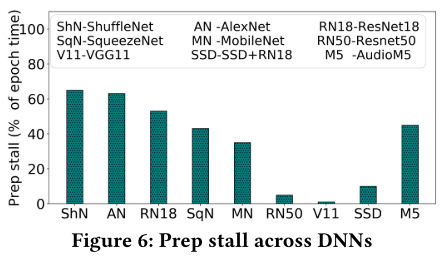

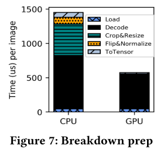

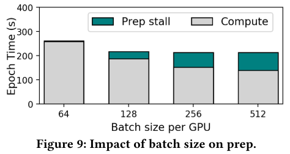

* **Data stalls는 모든 프레임워크에서 공통적으로 관찰됨**

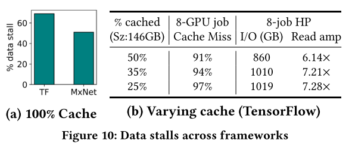

## DS-ANALYZER: PREDICTIVE ANALYSIS
### Estimating Data Stalls

### Example: Predicting Optimal Cache Size
 * Frameworks like PyTorch and TensorFlow provide an approximate time spent on data loading and pre-processing per minibatch, by simply placing timers in the training script. This is insufficient and inaccurate.
	- This technique cannot accurately provide the split up of time spent in data fetch (from disk or cache) and pre-processing operations.
	- Frameworks like PyTorch and libraries like DALI use several concurrent processes (or threads) to fetch and pre-process data.
 * Data stall in one of the data loading processes may reflect as GPU compute time for the other processes, because all GPU processes wait to synchronize weight updates at batch boundaries.
 * DS-Analyzer runs in three phases:
	1. Measure ingestion rate: DS-Analyzer pre-populates synthetic data at the GPUs and runs the job for a fixed number of epochs. (no fetch or prep stalls)
	2. Measure prep stalls: DS-Analyzer runs the training script with a subset of the given dataset, such that it is entirely cached in memory, using all available CPU cores, and estimates the training speed. (1 - 2 = prep stalls)
	3. Measure fetch stalls: DS-Analyzer runs the training script by clearing all caches, and setting maximum cache size to a user-given limit. (2 - 3 = fetch stalls)
 * Data Stalls:
	- Fetch Stalls (Remote): When dataset resides on remote storage.
		- We analyze the impact of two kinds of remote backends; a distributed file system (GlusterFS) and Azure blob object store (accessed via blobfuse)
		- When data resides remotely, the first epoch of training fetches data over the network and stores it locally for subsequent use.
		- The first epoch when it downloads the entire dataset to local storage, and can result in 20x higher training time as compared to GFS.
		- GFS results in more data stalls as it validates metadata of cached data items over the network every item a data item is accessed.
		- Blobfuse does not incur any network cost beyond first epoch, if the datset fits on local SSD.
		- Therefore, a common trining senario is to pay a one-time download cost for the dataset, and reap benefits of local-SSD accesses thereafter.
		- In the rest of the work, we analyze fetch stalls in senarios where dataset is present locally on a server, but is not entirely cached in memory. → 프로젝트에서 고려해야 할 시나리오는 local disks와 local memory 모두에 fit되지 않을 때
	- Fetch Stalls (Local): When datasets cannot be fully cached and the fetch rate < compute rate.
        - Popular dataset like ImageNet-1K cannot be fully cached on commonly used cloud SKUs.
        - DNNs spend 10-70% of their epoch time on blocking I/O, despite pipelining and prefetching, simply because the compute rate is higher than fetch rate.
        - DNN training platforms rely on the operating system's Page Cache to cache raw training data in memory. Unfortunately, the OS Page Cache leads to thrashing as it is not efficient for DNN training.
        - The lack of coordination among caches makes distributed training storage I/O-bound.
    - Data stalls exist across training frameworks.
        - TF shuffles the small random files, serializes it, and stores them as a set of files called TFRecords. TFRecords make reads more sequential.

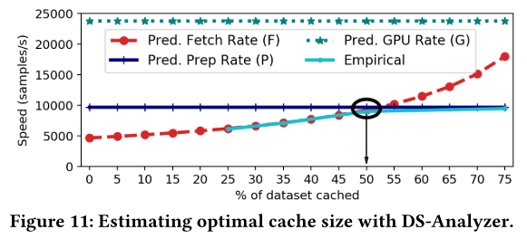

## MITIGATING DATA STALLS
### The MinIO Cache
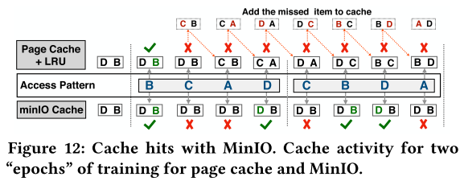 
* DNN training has a unique data access pattern: it is repetitive across epochs and random within an epoch.
* The DNN access pattern that is at odds with usual OS cache replacement (e.g. LRU) policies.
* MinIO recommends a simple and unintutive solution; items, once cached, are never replaced in the DNN cache.

### Partitioned MinIO Caching
* Each server operates on a random shard of the dataset per epoch, and this partition changes every epoch. The MinIO cache alone, is not efficient in this setting.
* Partitioned MinIO caching works as follows:
* In the first epoch, the dataset is sharded across all servers.
* Each server populates it's local MinIO cache with data items in the shard assigned to it.
* At the end of first epoch, we collectively cache a part of the dataset of size equal to the sum of capacities of individual MinIO caches.
* To route data fetch requests to the appropriate server, we maintain metadata about data items present in each server's cache.

### Coordinated Prep

### Trying It All Together with CoorDL
* We build CoorDL on top of DALI to take adventage of the GPU-accelerated data pre-processing operations.

## EVALUATION
### Single-server Multi-GPU Training
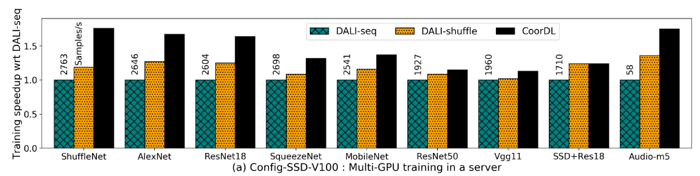 

### Multi-server Distributed Training
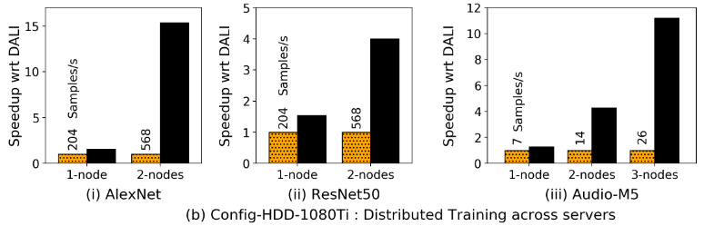 
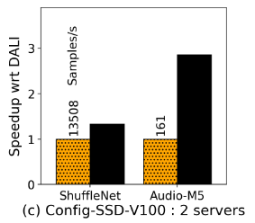 

### Hyperparameter Search
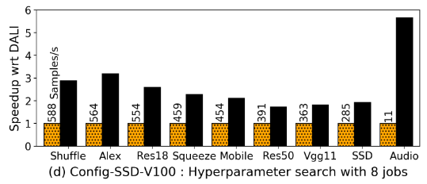 
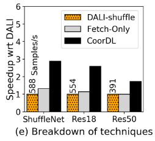 
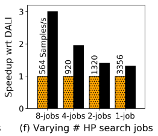 

### Training to Accuracy with CoorDL
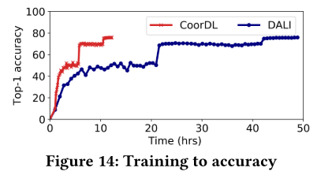 

### Resource Utilization
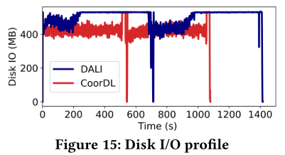 

### CoorDL on DGX-2
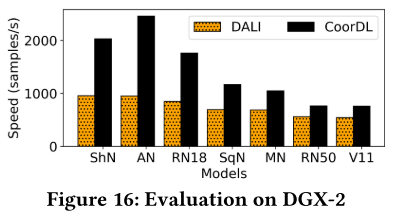 

## DISCUSSION

## RELATED WORK

## CONCLUSION