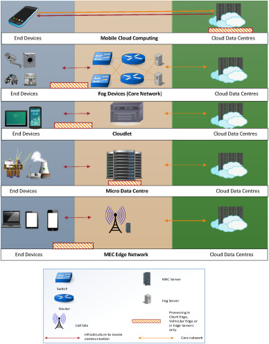
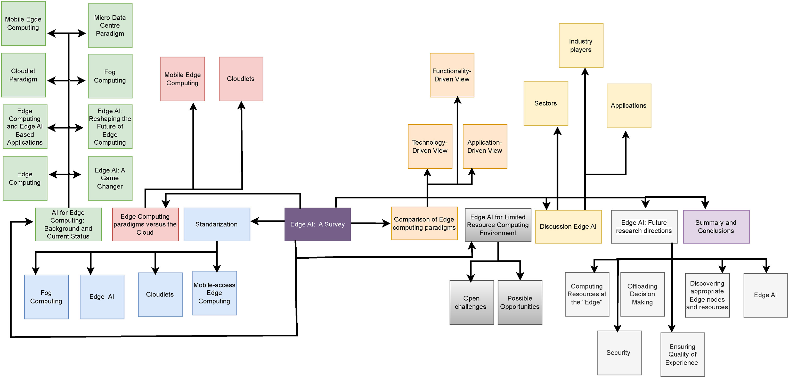

## Introduction
* 2000년대 이후, 리소스가 풍부한 데이터 센터를 기반으로 '*클라우드 컴퓨팅*'이라는 개념이 성립되었다.
* 클라우드 컴퓨팅의 주요 이점으로는 무한한 스토리지/컴퓨팅 자원, 금전적 비용 절약, 탄소 배출 저감 등이 있다.
* 현 시점에서 클라우드 컴퓨팅은, 보안 문제와 느린 서비스 속도(특히 대역폭이 낮고 Jitter가 큰 모바일 장치에서)를 개선해야 하지만, 모바일 장치가 점점 많아지면서 오히려 악화되어가고 있다.
* 하나의 큰 데이터 센터에 트래픽이 몰리는 문제를 해결하기 위해, *에지 컴퓨팅*이라는 구조가 제시되었다.
    - Edge computing: 코어로부터 분리된 여러 개의 에지 서버를 두고, 에지에서 처리 가능한 연산은 코어로 넘기지 않고 에지에서 처리하여 응답하는 형태의 클라우드 컴퓨팅
* 많은 리소스를 사용하지 않으면서, 일시적으로 클라우드 서비스를 사용하는 경우를 고려한 *cloudlet*이라는 패러다임이 등장했다.
    - 빠른 응답을 요구하는 고정된 장치들의 가용성을 높이고, 증가하는 사용량을 감당하기 위함이다.
    - 이는 후에 포그 컴퓨팅으로 발전한다.
* 2011년부터 스마트폰이 대중화되면서, 많은 리소스를 필요로 하는 모바일 애플리케이션이 증가했다.
* 많은 모바일 장치가 원격 데이터 센터를 이용하여 고수준의 처리를 제공하고 있지만, 언제 어디서나 이용되는 모바일 애플리케이션의 특성 상, 높은 QoE와 보안 수준을 보장하는 것은 더욱 어렵다.
* 에지 컴퓨팅은 Wi-Fi, 3G, 4G, 5G 등의 여러 무선 네트워크 및 다양한 이기종 장치를 지원할 수 있어야 한다. 
* *Mobile-access Edge Computing (MEC)*은 모바일 장치가 에지 서버의 리소스를 이용하는 에지 컴퓨팅 패러다임으로 제시되었다.
    - MEC의 가장 단순한 형태는, 모바일 장치 근처에서 클라우드 컴퓨팅 서비스를 제공하여 네트워크 지연 시간을 감소시키는 것이다.
* MEC은 *Multi-access Edge Computing*으로 이름이 바뀌면서, 비-모바일 장치를 위한 애플리케이션 개발까지 포함하는 개념이 되었다.

* 에지 컴퓨팅은 다양한 방식으로 구현할 수 있다. (실제 기능이 단말에 구현되어 있을 수도 있고, 에지에 구현되어 있을 수도 있음)
    - FC 단말(e.g., CCTV)은 데이터를 일부 처리하여 포그 노드로 전송할 수 있다.
    - 간단한 cloudlet 서버는 직접 요청을 처리하거나, 단말과 협동하여 처리할 수 있다.
    - Micro Data Center (MDC)는 여러 사용자 요청을 로컬에서 처리한다.
    - MEC은 모바일 장치의 제약으로 인해, 클라우드 데이터 센터가 처리를 담당하므로 **에지 컴퓨팅이 아니다.**

* Edge AI란 사용자와 가까운 네트워크 에지에서 AI 계산을 수행하는 것을 말한다.

### Article structure

## Background
* 에지 컴퓨팅은 멀리 있는 데이터 센터의 데이터 처리 능력을 물리적으로 사용자에게 더 가까운 서버로 옮겨 고수준의 애플리케이션을 지원한다.
* 에지 컴퓨팅의 구현에는 여러 가지 패러다임―cloudlet, fog computing, MEC, mDC―이 존재한다.
    - Cloudlet은 소규모 사업에 적용하기 좋음
    - Fog computing은 빠른 처리와 대용량 데이터 분석이 필요한 IoT 장치에 적합함
    - MEC은 대규모 모바일 장치를 대상으로 하는 애플리케이션을 타겟으로 함
    - mDC는 특정 장소에 존재하거나 일시적인 산업 애플리케이션에 최적화됨
* MEC은 대규모 IoT 장치와, 매우 다양한 무선 네트워크가 존재하는 환경에서, 에지 컴퓨팅 시스템에 적합한 애플리케이션을 개발하는 것이 목적이다.

### Edge computing
* 에지 컴퓨팅의 성능 매개변수로는 지연 시간, Jitter, 제한된 대역폭 등이 있다.
* 에지 컴퓨팅을 구현할 때에는, 다음과 같은 기준을 고려하여야 한다.
    - 서비스의 민첩성 (Agility of Services)
    - 낮은 지연 시간 (Low Latency)
    - 일관성 (Coherence)
    - 한 번의 장애가 전체 시스템에 영향을 주지 않음 (No Single Point of Failure)

### Edge AI: A game changer
* 최근 몇 년간 에지 장치에서 제공하는 서비스가 점점 복잡해지면서, 에지에 AI를 배치하고 사용할 필요성이 대두되고 있다.
* 과거에는 성능 상의 한계로 인해, 에지 장치에서 딥러닝 학습이나 모델 배포가 불가능했으나, 현재는 에지 장치의 컴퓨팅 성능이 크게 향상되어 실시간 데이터 처리 및 높은 수준의 보안 유지가 가능한 수준이 되었다.
    - 대표적으로, 온도 조절기, 도어락, 차량용 카메라, AR/VR 기기 등이 있다.
* Edge AI를 이용하면, 실생활에서 사용하는 기기가 데이터를 빠르게 학습하고 이해하여 작동할 수 있고, 데이터 처리의 보안도 더욱 강화되며, 결과적으로 QoE가 높아진다.
* Edge AI의 전망은 매우 밝다.
    - International Data Corporation (IDC)는 2025년까지 1,500억 개의 지능형 에지 장치가 사용될 것으로 예측하고 있다.
    - Gartner는 2025년까지 기업에서 생성되는 데이터의 75%가 데이터 센터나 클라우드 외부에서 생성 및 처리될 것으로 기대하고 있다.
* 그러나, Edge AI로 전환하기 위해서 해결해야 할 과제들이 많다.

### Edge AI: Reshaping the Future of Edge Computing
* Edge AI는 모바일 장치나 IoT 장치에서 AI 알고리즘과 기법을 사용하는 것을 말한다.
* 머신 러닝 알고리즘과 기법을 로컬 장치나 에지에 배치하면 처리 시간을 크게 줄일 수 있고, 보안 수준도 높일 수 있다.
* Edge AI는 *계산 지능 (computational intelligence)*을 구현하는 데 이용될 수 있다.
    - Computational intelligence: 경험을 통해 학습하고, 변화하는 환경에 적응할 수 있는 지능적인 시스템을 말한다.

### Edge computing and edge AI based applications
* 에지에서의 계산 오프로딩
    - 에지 장치의 리소스가 제한적이므로, 기능 확장을 위해서는 오프로딩이 수행되어야 한다. 
    - 오프로딩으로 인한 지연 시간을 줄이기 위해 에지 서버로 계산을 오프로딩하지만, 여전히 고려해야 할 사항이 많다. (e.g., 어떤 작업을 오프로딩할 것인가? 에지 서버가 과부하 상태가 되면 어떻게 하는가?)
* 문맥 인식 애플리케이션
    - 기존의 웹 서비스는 서비스 제공자가 사용자의 이전 활동 기록을 기반으로 컨텐츠를 추천한다.
    - Edge AI를 활용하여 사용자의 지리적 위치나, 애플리케이션이 분석한 정보를 기반으로 컨텐츠를 제공할 수 있다.
* 스마트 교통
    - Edge AI를 활용하여, 신호등 및 CCTV 카메라에서 수집된 데이터를 통해 교통 관리를 자동으로 수행할 수 있다.
    - 각 센서가 차량 이동을 감지하여, 이러한 정보를 교통 관리에 반영한다.
    - 긴급한 상황에 빠른 결정을 제공하기 위해, 계산 능력을 더 가까운 곳에 반영하여 네트워크로 인한 지연 시간을 줄이는 것이 중요하다.

### Cloudlet paradigm
* Cloudlet은 소규모 사업체에서 소수의 모바일 장치가 이용할 수 있는 작은 데이터 센터를 제공하는 방식이다.
* 데이터 센터가 제공하는 서비스는 워드 프로세싱, 이미지 편집 등으로, 모바일 장치는 Linux의 오픈 소프트웨어를 이용할 수 있다.
* 사용자는 Wi-Fi를 이용하여 일시적으로 cloudlet에 액세스하며, 데이터 센터는 서비스 제공을 위한 가상 머신을 생성한 뒤, 서비스가 끝나면 가상 머신을 제거한다.
* 그러나, cloudlet은 별다른 반향을 이끌어내지 못했다.
    - 대부분의 모바일 장치 사용자는 소셜 미디어를 주로 이용했으며, 따라서 그러한 서비스를 별로 필요로 하지 않았다.
    - 수익성이 떨어진다.
* 모바일 장치와 클라우드 사이를 이어주는 개념으로 바뀌었고, 현재는 로컬 수준에서 IoT 애플리케이션의 지연 시간을 줄이는 데에 활용되고 있다.

### Fog computing
* 포그 컴퓨팅은 단말과 클라우드 사이에 FC ("distributed intelligence)로 이루어진 필드 영역 네트워크 (field area network)를 추가한 구조이다.
* 포그 컴퓨팅 개념을 제시한 Cisco는 데이터를 수집하는 장치 근처에서 분석이 이루어지면 재해를 피할 수 있고, 연쇄적인 시스템 장애를 예방할 수 있다고 주장했다.
* 컴퓨팅, 스토리지, 네트워크 자원을 갖춘 모든 장치를 포그 노드로 사용할 수 있다. (e.g., 산업용 컨트롤러, 스위치, 라우터, 감시 카메라 등)
* 물리적으로 밀도 있게 노드가 분포되어 있어, 빠르게 대용량 데이터를 분석할 수 있다는 장점이 있다.

### Mobile edge computing
* Mobile Edge Computing (MEC)이란 모바일 사용자와 근접한 무선 액세스 네트워크 내에서 클라우드 컴퓨팅 기능을 제공하는 것을 말한다.
    - Cloudlet은 무료 액세스 기반 비즈니스 모델, 포그 컴퓨팅은 모바일 기기를 중심으로 한 IoT라는 점에서, 세 가지 패러다임이 구분된다.
* 모바일 에지에 배치된 장치를, 모바일 액세스 포인트로 다시 구성하는 것이 핵심으로, 기지국은 트래픽을 전달하면서 동시에 MEC 서버로서 계산 및 저장 기능을 제공한다.
* MEC 구조는 모바일 장치의 대역폭과 확장성을 향상시키면서, 모바일 사용자를 위한 새로운 대규모 서비스가 등장할 수 있는 기반을 마련한다.

### Micro data center paradigm
* 다른 패러다임과 비교했을 때, 에지 컴퓨팅에 대한 하드웨어 솔루션에 가깝다.
* Cloudlet, 포그 컴퓨팅, MEC과 같이 활용할 수 있다.

## Performance of edge computing paradigms versus the cloud

## Comparison of edge computing paradigms and edge AI

### Application-driven view

### Functionality-driven view

### Technology-driven view
* Edge AI에서의 핵심 기술은 다음과 같다.
    - Edge device: 연산 능력과 저장 공간을 갖추고, 로컬에서 AI 알고리즘을 실행하는 하드웨어
    - ML Frameworks
    - Neural network architectures
    - Model compression: 중복 정보를 제거하여 머신 러닝 모델의 크기를 줄이는 작업.
    - Federated learning: 다수의 클라이언트와 하나의 중앙 서버가 협력하여, 탈중앙화된 데이터를 사용해 글로벌 모델을 학습시키는 것. 데이터가 이동하지 않으므로 프라이버시 및 네트워크 트래픽 측면에서 이점이 있다.
    - Edge-to-cloud integration: 에지 장치에서 실시간 처리를 수행하고, 클라우드에서는 모델을 학습시키는 하이브리드 솔루션.

## Edge AI for limited resource computing environment
### Open challenges
* 컴퓨팅 자원: 에지 장치는 보통 중앙 클라우드에 비해 사용할 수 있는 컴퓨팅 리소스가 적다. 따라서 고수준의 AI 모델과 기술을 실행하는 것은 어렵다.
* 인터네트워킹: 에지 장치에서 대량의 데이터 또는 모델을 이동할 때, 네트워크 액세스가 문제가 될 수 있다. 실시간 데이터 입력이 지연되면서, AI 알고리즘의 품질과 신뢰성이 떨어질 수 있는 것이다.
* 데이터 기밀성 및 보안: 개인 정보 또는 기밀 자료를 수집하는 에지 장치에서는 데이터 보안과 기밀성 보장이 필요하다.

### Possible opportunities
* 이용할 수 있는 자원이 제한적일 때, AI 시스템을 구현하여 얻을 수 있는 이점
* 실시간 데이터 분석: 네트워크 지연 시간을 줄여, 실시간 데이터 분석을 제공할 수 있다.
* 지연 시간 최소화: time-sensitive 서비스를 제공할 수 있다.
* 개인 정보/보안 강화: 인터넷을 통해 전송하는 데이터의 양을 줄임으로써 기밀성과 보안 향상에 도움을 준다.

## Discussion

