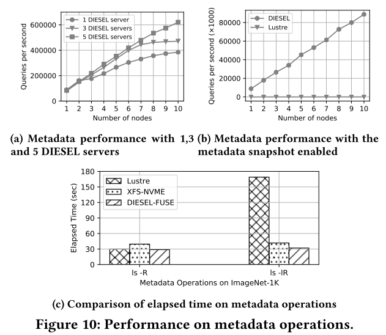

## INSTRODUCTION
* Deep learning training (이하 DLT) 작업에 사용되는 데이터 세트 안에는 수많은 작은 파일들이 카테고리 별로 분류되어 있는데, 따라서 파일 접근에 걸리는 시간이 매우 큰 부분을 차지한다.
  - A popular image dataset for computer vision tasks, ImageNet-1K, contains more than 1.28 million files in 1,000 categories. (Average image size is 110KB)
  - The Open Images dataset contains around 9 million images. (Average image size is 60KB) 
* DL 프레임워크는 컴퓨터 클러스터에서 동작하며, 데이터 세트 저장에 공유 스토리지를 이용하기도 하는데, 공유 스토리지를 이용하는 컴퓨터 클러스터가 커지면 수많은 랜덤 액세스가 동시에 발생해 스토리지가 포화 상태가 될 수 있다.
* 작은 크기의 파일에 접근하는 것은 *메타데이터-인텐시브*하므로, 관련 연구들은 캐싱을 통해 메타데이터 서버의 성능 개선에 주안점을 두고 있지만, 대부분 파일 수준의 캐싱 시스템이기 때문에 느리다.
  - Global caching system, such as Quiver and in-memory caching middleware, e.g., Memcached cluster, are deployed to relieve the I/O pressure on the underlying storage systems.
* 이러한 I/O 문제는 가속기의 성능이 강력할수록 심화된다.
  - Massively parallel processors, the performance of data movements significantly falls behind the computation speed.
* **본 논문에서는, DLT 작업의 I/O 특성을 이용한 스토리지 및 캐싱 시스템 DIESEL을 설계했다.**
  - First, DLT tasks have seperate read and write phases. (This seperation enables *stateless metadata cache designs*.)
  - Second, in each training job, the dataset is read multiple times. (Dataset-based access pattern)
  - Third, in DLT tasks, the input files are not required to be accessed in a fixed order, as long as the access order is randomized. (We can perform the data shuffling in a *storage-friendly layout* with very small memory footprint.)
* DIESEL의 특징은 다음과 같다.
  - **Metadata processing offloading**: 여러 파일을 청크 단위(e.g., 4MB)로 압축하여 in-memory key-value store에 저장하고, 학습 시 메타데이터 스냅샷을 DLT 노드에 분산시킨다.
  - **Task-grained distributed caching system**: 모든 DLT 노드의 메모리를 합쳐서 사용한다. 한 노드에서 발생한 문제가 전체 작업에 미치는 영향을 최소화한다.
  - **Chunk-wise shuffling**: 청크 단위 I/O지만, 파일은 기존 방식처럼 완전히 랜덤한 순서로 읽는다.

## BACKGROUND
### I/O Charateristics of Deep Learning
* DLT 작업의 파일 액세스 특성은 다음과 같다.
  1. Separate write and read phases: 학습 단계에서는 파일을 읽기만 한다.
  2. Iterative and traversal read: 에포크 횟수만큼 데이터 세트를 반복해서 읽는다. 한 에포크에 전체 데이터 세트의 모든 파일을 한 번씩 읽는 것이 일반적이다.
  3. Shuffled file access order: 매 에포크 시작 전 파일 순서는 랜덤하게 뒤섞인다. 이는 과적합(overfitting)을 막기 위함이다.

### Limitations of Current Systems
* 메타데이터 처리 측면
  - Lustre는 DNE (i.e., Distributed Namespace)라는 기능을 통해 서브-디렉토리 또는 디렉토리의 구조를 MDTs (Metadata Targets)에 분산시켜 메타데이터 처리 속도를 높인다.
  - 그러나, (1) 서브-디렉토리는 각각 하나의 MDT에만 매핑되므로, 한 디렉토리 내 파일이 매우 많은 경우 MDT에 가해지는 부하가 매우 커지고, (2) 디렉토리 구조를 분산시키는 경우엔 한 디렉토리의 메타데이터가 여러 MDT에 나뉘어 저장되기 때문에, 메타데이터를 가져오는 데에 MDT 순회가 다수 발생한다는 문제가 있다.
* 캐싱 시스템 측면
  - Global in-memory caching system(e.g., Memcached)을 통해 클러스터 내에서의 파일 접근 속도를 향상시킬 수 있다.
  - 그렇지만, 시스템을 구성하는 한 노드에 문제가 생기면 전체 작업이 중단되고, 데이터 세트가 캐시에 다 저장되지 않는 경우 스레싱이 발생할 수 있다는 문제점이 있다.

## RELATED WORK
* **메타데이터 관리 최적화**
  - TableFS, IndexFS, DeltaFS: Log-structured merge tree (LSM-tree) 구조를 활용 
  - GiraffaFS: 메타데이터를 고성능 분산 데이터베이스인 HBase에 저장
  - HopsFS: HDFS의 단일 노드 메타데이터 서비스를 분산 메타데이터 서비스로 변경
  - LocoFS: 디렉토리 컨텐츠와 구조를 분리하여 서로 다른 key-value database에 저장
  - Lustre, GPFS, Ceph: 파일 네임스페이스별로 캐싱 시스템 보유, 파일 탐색 및 디렉토리 순회 속도 향상
  - Google GFS: 단일 마스터 노드에서 메타데이터를 메인 메모리에 저장
  - **DIESEL은 분산된 key-value store를 이용하며, 메타데이터 스냅샷 기능을 제공한다.**
* **딥러닝을 위한 분산 스토리지/캐싱**
  - FanStore: MPI-based 런타임 스토리지 시스템으로, 데이터 세트를 청크로 분할하여 여러 노드에 분산시켜 저장한다. (Chunk-wise shuffling 미지원)
  - DeepIO: In-memory 스토리지 시스템으로, memory-based shuffling, entropy-aware opportunistic ordering techniques가 적용되었다. (Transparent하지 않음)
  - DLFS: DeepIO를 NVMe-oF 장치로 확장시킨 시스템이다.
  - Quiver: 안전한 bash-based 파일 탐색을 채택한 캐싱 시스템으로, co-ordinated eviction, benefit-aware techniques가 적용되었다. (Caching layer에서만 동작하고, storage layer를 고려하지 않음)
  - **DIESEL은 캐싱과 스토리지 단계를 모두 아울러 설계된 시스템이다.**

## DIESEL DESIGN
  

* 다양한 최적화 방법이 적용되었다. (메타데이터 관리, 분산 캐싱, 데이터 셔플)
* **Request executor**는 작은 파일 요청을 정렬하고, 청크 단위의 연산으로 병합한다.
* 두 가지 파일 접근 방법을 제공한다.
  - libDIESEL 라이브러리를 통해 파일 접근
  - FUSE를 통해 DIESEL을 마운트하여 사용 (libDIESEL로 구현됨)
* **libDIESEL 라이브러리**에는 두 개의 메인 구성 요소가 포함되어 있다.
  - **메타데이터 캐시와 인터프리터**: 로컬 디스크에서 메타데이터 스냅샷을 가져오고 해석한다.
  - **Task-grained 데이터 세트 캐시**: 실행 중 학습 데이터 세트를 캐시한다.
* **DLCMD**는 CLI로, DIESEL에 저장된 데이터 세트를 관리할 때 사용한다.
* **DIESEL 서버**는 기존 스토리지와 key-value 데이터베이스 관리자가 배포할 수 있다.
* **메타데이터 스냅샷**은 서버로부터 자동으로 다운로드하고, 학습 시 메모리에 로드하여 사용한다.

  
* Figure 3은 DIESEL의 write flow를 보여준다.
1. 사용자가 libDIESEL 또는 DLCMD를 이용해 로컬 디스크의 파일을 DIESEL에 저장한다.
2. 클라이언트 단에서 파일을 묶어서 청크 단위로 만든다. 메타데이터는 청크의 앞부분에 저장된다.
3. DIESEL 서버는 청크를 받아, 메타데이터를 추출한다. 메타데이터는 key-value 쌍으로 만들어 key-value 데이터베이스에 저장하고, 데이터 청크는 스토리지 시스템에 저장한다.

  
* Figure 4는 DIESEL의 read flow를 보여준다.
1. 사용자는 libDIESEL 또는 FUSE를 통해 읽기 요청을 보낸다.
2. 클라이언트 단에서 task-grained distributed cache가 활성화되어 있다면, 해당 요청은 연관된 피어(peer)로 전송된다.
3. task-grained distributed cache가 비활성화되어 있거나, 캐시 miss가 발생하면 해당 요청은 서버로 전송된다.
4. 서버의 캐시가 활성화되어 있고, 요청에 해당하는 데이터 청크가 캐시되어 있다면, 빠른 오브젝트 스토리지인 SSD-based 스토리지로 요청을 보낸다.
5. 서버의 캐시가 비활성화되어 있거나 캐시 miss가 발생하면, 해당 요청은 느린 오브젝트 스토리지인 HDD-based 스토리지로 전송되고, 서버는 해당 데이터 청크를 빠른 오브젝트 스토리지에 캐시한다.

### Data Layout and Metadata Organization

* Figure 5는 데이터 청크의 레이아웃과 메타데이터 설계를 보여준다.
* 데이터 청크는 self-contained한 특성이 있어서, DIESEL 서버는 데이터 청크로부터 모든 key-value 쌍을 복구할 수 있다.
* **메타데이터 처리를 메타데이터 스토리지로부터 분리**
  - 데이터의 직렬화/역직렬화는 key-value 데이터베이스가 아닌 DIESEL 서버에서 수행되며, 파일 시스템 연산 또한 DIESEL 서버가 key-value 연산으로 변환한다.
* **Fault-recovery**
  - 최근에 저장한 key-value 쌍이 소실되는 경우 (node failure) 특정 타임스탬프의 데이터 청크를 스캔한다.
  - 모든 in-memory key-value 쌍이 소실되는 경우 (data center power failure 등) 모든 데이터 청크를 저장한 순서대로 스캔한다. 타임스탬프를 이용해 청크 ID를 생성하므로, 저장한 순서대로 정렬이 가능하다.
* **메타데이터 스냅샷**
  - 메타데이터 데이터베이스에 가해지는 부하를 줄이기 위해, 클라이언트의 로컬 디스크에 메타데이터 스냅샷을 저장한다.
  - 메타데이터 스냅샷에는 데이터 세트 업데이트 타임스탬프 (최신 버전인지 확인하는 용도), 청크 ID 리스트, 파일의 메타데이터(청크 ID, 오프셋, 길이, 전체 이름)가 존재한다.
  - 공유 스토리지에 저장하면, 클라이언트마다 스냅샷을 저장할 필요가 없다.

### Task-Grained Distributed Cache
* Global in-memory 캐싱 시스템이 존재하지만, DLT는 샘플을 무작위 순서로 읽기 때문에 node failure로 인한 성능 저하가 심각하다.
  - Global in-memory caching system: 클러스터 내의 모든 노드의 메모리를 하나의 큰 메모리처럼 사용. 더 많은 데이터를 캐싱할 수 있다.
 
* Figure 6는 캐시 적중률에 따른 읽기 속도를 나타낸 것이다. 적중률이 낮아지면, 파일 접근 속도는 더 큰 폭으로 떨어진다.
* *Task-grained distributed cache*는 데이터 세트를 여러 DTL 노드에 걸쳐 캐싱한다.
* 일부 노드에 문제가 생기면 (캐시 miss를 의미하는 듯), 해당 노드에 영향을 받는 DTL 작업만 중단된다.
* 청크 단위로 관리하므로, 데이터 세트를 빠르게 캐싱할 수 있다.
 
* Figure 7은 task-grained distributed cache의 동작을 보여준다.
  - 사용자 애플리케이션은 여러 개의 I/O worker를 실행한다. 각각의 worker는 DIESEL 클라이언트를 생성한다.
  - DIESEL 클라이언트에는 랭크가 매겨져 있다.
  - 랭크 0 클라이언트가 마스터가 된다. 마스터 클라이언트는 다른 클라이언트에 데이터를 분배한다.
  - 모든 클라이언트는 마스터 클라이언트에 연결되어 있어, 캐시에서 데이터를 탐색하는 데 걸리는 hop은 항상 1이다. (DeltaFS에서 사용하는 multi-hop routing 메소드보다 효율적)
* **Oneshot cache policy**: DIESEL 서버에 등록하는 즉시 데이터 세트를 로컬 스토리지로 다운받는다. 사용자가 학습시킬 모델을 로드하면, DIESEL 클라이언트가 데이터 세트를 백그라운드에서 캐싱하여 첫 번째 에포크에 걸리는 시간이 줄어든다. (보통 첫 번째 에포크를 cache warming 단계로 치는데, 여기서는 학습 시작 전부터 hot cache를 만드는 것)
  - On-demand cache policy(캐시 miss가 발생하면 필요한 데이터 청크를 가져온다.)도 지원한다.

### Shuffle in Memory-Constrained Scenario
* DLT 작업에서 모델의 과적합을 방지하기 위해 데이터 세트 학습 순서를 매번 섞는데, 이러한 I/O 특성은 성능을 크게 저하시킨다. (특히, 데이터 세트를 100% 캐싱할 수 없을 때)
* DIESEL은 한 번에 많은 데이터를 읽으면서, 매번 무작위 순서를 유지하는 *chunk-wise shuffle* 방법을 제시한다.

 
* Figure 8은 chunk-wise shuffling을 보여준다.
  1. 청크를 무작위로 섞는다.
  2. 청크를 N개의 그룹으로 나눈다. (N은 사용자가 지정한 그룹 크기)
  3. DIESEL은 그룹에 포함된 파일 정보를 추출하여, 해당 그룹 내의 파일들을 무작위로 섞는다.
  4. 클라이언트에서 파일을 읽으면, 해당 파일이 속한 청크 전체를 캐싱한다.

## IMPLEMENTATION
* DIESEL 서버는 Go로, 클라이언트는 C++로 구현했다.
* 데이터 스토리지로 Ceph를 비롯한 POSIX-based 분산 스토리지 시스템을 지원한다.
* 메타데이터 스토리지로 Redis를 비롯한 key-value 데이터베이스를 지원한다.
* 서버와 클라이언트 사이 RPC 레이어로 Apach Thrift를 사용했다.

## EVALUATION
### Experimental Setup

### Performance on File Writing
 

### Efficiency of Metadata Access and Snapshot
 

### Efficiency of Task-Grained Distributed Cache
 

### Efficiency of Chunk-Wise Shuffle Method
 

 

### Evaluation in DLT Tasks
 

 

## CONCLUSION