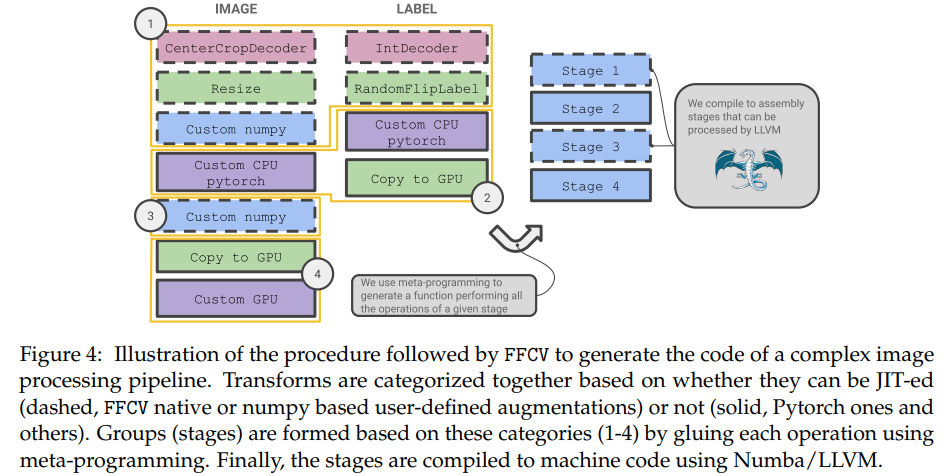

## Introduction

## Identifying Bottlenecks in Training

## Eliminating Data Bottlenecks
### Challenge #1: Storing a Machine Learning Dataset
  

### Challenge #2: Efficient Data Reading

### Challenge #3: Fast Data Processing
  

## Case Studies
 
### Training a single model
### Training multiple models
### Low-memory training
### Beyond computer vision
 

## Related Work

## Conclusion